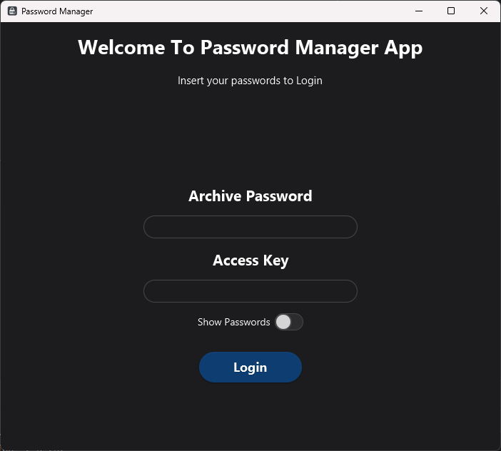
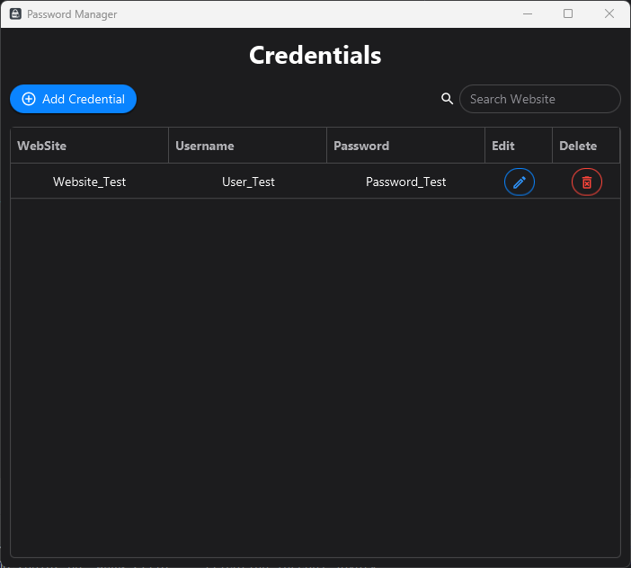
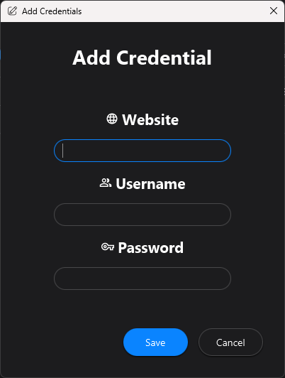
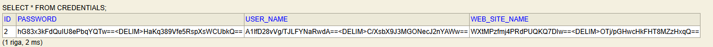

# PasswordXManager
PasswordXManager is a project based on JavaFX + Springboot with an embedded H2 Database for managing Personal Website Password using AES-256 encryption

---

## Badge
  

## Index

- [Description](#description)  
- [Functionality](#functionality)  
- [Screenshot](#screenshot)  

---

## Description

This project born either for personal exercise and to have a way to store website credentials out of the classic internet-related programs.  
Even if i'm not trying to master the cyber-security side of development, i tried to make this program the safest possible using the AES-256 algorithm to store the credentials in the database, and also the AES-Key is encrypted in a keystore generated in the first time signup.  
The program implements the basic CRUD operation to manage credentials.  
The JavaFX side of the program use the AtlantaFx Stylesheet and the ikonli-Material2 icon pack.  

---

## Functionality

- CRUD Operation for credentials  
- Login with double password for accessing Keystore and Program
- Real-time search bar for Website by name
- Double-click on credential to copy on clipboard

---

## Screenshot

Esempio di interfaccia o output del progetto:

---
